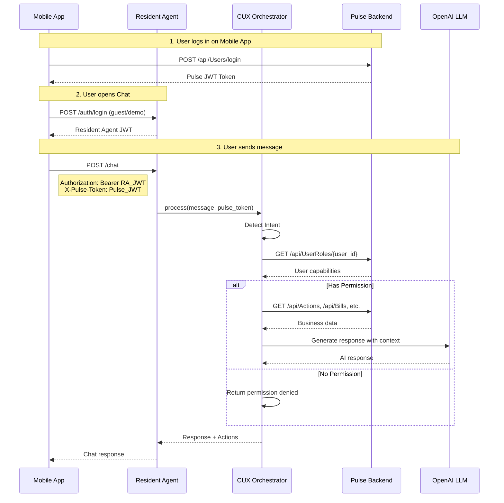

# Architecture

> **Note:** This document describes the **Resident Agent** (AI Chat Service).
> For Pulse Backend (.NET) architecture, see `app/Pulse-dotnetBE/README.md`.

## System Overview

Pulse consists of two main services:

| Service | Technology | Purpose |
|---------|------------|---------|
| **Resident Agent** | Python (FastAPI) | AI Chat, Intent Detection, Workflow Automation |
| **Pulse Backend** | .NET 9 | Business API, CRUD Operations, Payment Gateway |

## Chat Flow

## Authorization Flow

The system uses **two separate JWT tokens** with passthrough mechanism:

| Token | Issued By | Purpose |
|-------|-----------|---------|
| **Pulse Backend JWT** | Pulse Backend (.NET) | Access Pulse APIs (mobile app login) |
| **Resident Agent JWT** | Resident Agent (Python) | Access Chat APIs |

### Key Points

- **Separate tokens**: Each service issues its own JWT
- **Token passthrough**: Mobile app passes Pulse token via `X-Pulse-Token` header
- **Permission check**: Resident Agent uses Pulse token to fetch user capabilities
- **Fallback mode**: Works with mock data if Pulse Backend unavailable
